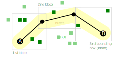

# Making the Wahoo ELEMNT Bolt v2 more useful


## Disclaimer

1. Programs and information offered here are not official from Wahoo, but purely a private project
2. Use this project at your own risk. Following these instructions may
	- void your warranty
	- damage your device
	- cause unexpected issues
4. Programs here are all in their early stages, 
	not tested everywhere, not particularly optimized or fault-tolerant, 
	not translated into English at all points.


## Overview

- [Basics](#basics)
- [Points of Interest (POI)](#points-of-interest-poi)
- [Screen Recording](#screen-recording)


## Basics

- Bolt runs an old Android operating system which is accessible via USB-Cable and the _Android Debug Bridge_ (ADB) tool
- consider [WebADB](https://app.webadb.com) via Chrome browser (using WebUSB) when unable to install ADB for some reason 
	(though some security/privacy risk)
- Bolt authorizes ADB in debug mode:
	1. power up without USB-Cable plugged in, 
	2. press POWER+UP+DOWN simultan. (1 or 2 times)
	3. white Bolt LED flashes for a second if successfully
	4. plug in cable
	5. I had to retry this several times until this "common" method finally worked; 
		I also pressed UP+DOWN during Bolt's "warm up" phase when it worked
- Bolt supports file formats: 
	- FIT (newer Garmin binary with smaller filesize)
	- [TCX](https://en.wikipedia.org/wiki/Training_Center_XML) (older Garmin plaintext)
	- GPX (plaintext)


## Points of Interest (POI)

### Motivation

- distance cycling / bikepacking
- requires food, drinking water (cemetery), toilets, shelter (= POI types) along the route
- cyclist might miss nearby POIs, either planned or non-planned


### v2-Bolt's POI support is very basic

- native function on the device: "Save my location" = no manual coordinates
- adding POIs manually via smartphone companion app = pain
- adding POIs manually by editing the BoltApp database via ADB and a SQLite client = no POI types (heart-icon only) and might not scale well
	- DB-file: `/data/data/com.wahoofitness.bolt/databases/BoltApp.sqlite`
	- DB-table: `CloudPoiDao`
	- https://www.youtube.com/watch?v=Sl--gcJ95XM
- self generated maps with POI-symbols = best approach but nasty setup and regular generation needs lot of time
	- https://www.heise.de/select/ct/2022/26/2230710050673252243
	- https://github.com/yokuha/Wahoo-maps
- custom CUE hints in FIT or TCX (not GPX) files will give a text warning when approaching the point + water tap icon
	- RwGPS premium feature? $$$
	- ```xml
		<CoursePoint> 
			<Name>Water</Name> 
			<Time>2023-10-19T17:13:09Z</Time> 
			<Position> 
				<LatitudeDegrees>x.xxxx</LatitudeDegrees> 
				<LongitudeDegrees>y.yyyy</LongitudeDegrees> 
			</Position> 
			<PointType>Water</PointType>   <!-- or: Food, Danger -->
			<Notes>Water!</Notes> 
		</CoursePoint>
		```


### Automate finding POIs along the route



- this project adds CUEs and/or edits the BoltApp SQLite database with POIs along our route found via OpenStreetMap (OSM); 
	manually adding POIs is too cumbersome
- CUEs are aligned and contained with a track but uploading new or changed tracks to the bike computer is more complicated now; 
	perhaps we can automatically replace existing files on the Bolt with extended versions?  
	How avoid:
	1. export from track editor, e.g. Komoot
	2. create new track by running tools in this repo against your track
	3. upload new track to smartphone
	4. import new track via companion app
	5. sync Bolt and app
	6. avoid confusing new and old tracks if autosynced with Komoot
- DB is independent of tracks (you can sync tracks with Komoot) or - negatively - not aligned with changed tracks, and requires separate cleaning/updating
	- good for covering a wider region (shelters?) but not a track


### Tools in this repository

| Executable   | Input files                         | Output files        | Comment
|--------------|-------------------------------------|---------------------|-------------------------------------
| setup.sh     | -                                   | /myenv              | installs deps into project-dir, so nothing left on your system after deletion
| gpx2poi.py   | my\_route.gpx                       | my\_route.geojson   | collects POIs via OpenStreetMap within 100 meter radius along the given route
| poi2tcx.py   | my\_route.gpx<br>my\_route.geojson  | my\_route.tcx       | converts _planned_ ride GPX file to a TCX with POIs added as CUEs (basic converter); test with gpsvisualizer.com
| poi2sql.py   | TODO                                | TODO                | TODO updates a local BoltApp SQLite database file 
  
  


## Screen Recording

- https://www.youtube.com/watch?v=dSMxnPvunco


