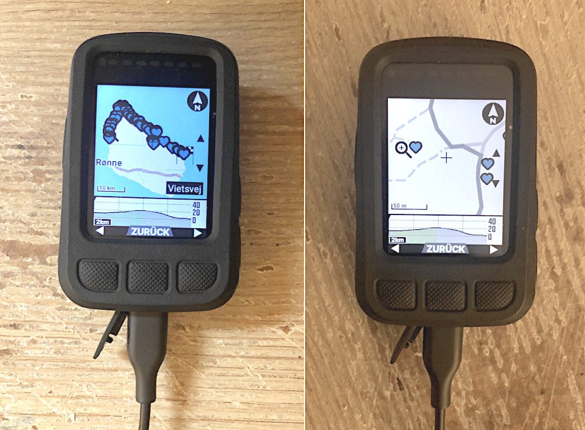

# Wahoo Elemnt Bolt v2 Playground


## Disclaimer

1. Programs and information offered here are not official from Wahoo, but purely a private project
2. Use this project at your own risk. Following these instructions may void your warranty, damage your device, cause unexpected issues
3. Programs here are not tested everywhere, not particularly optimized or fault-tolerant


## Auto-generated Points of Interest with gpx2poi & poi2db

  
(my Bolt with a rubber protective cover)

Without POIs a distance/bikepacking cyclist might miss nearby food/water.

- Finding POIs in a 100 meter radius along the route:  
	OpenStreetMap servers allow querying features within a polygon (Overpass API).
	Gpx2poi constructs a simplified polygon (a buffered line) from all the route points in a GPX route file (Komoot etc), 
	queries hundreds of POIs and writes them to `your_route.geojson`.
- Getting POIs to the Bolt:  
	Poi2db adds these POIs to Bolt's "Save my location" table on the device. 
	The sqlite database file is accessible via Android Debug Bridge ADB (credit to [AndroidAndyUK](https://www.youtube.com/watch?v=Sl--gcJ95XM)).
	Auto-generated POIs are stored with a magic number in the POI textual address field, so we can tell apart manual POIs from generated POIs.
	Poi2db always recreates the entire auto-POIs list from scratch given a list of geojson-files.
	Program parameter `--delete` removes all auto-POIs without adding new ones.
- Requires:
	- Linux
	- Python 3
	- `setup.sh` downloads all dependencies  (ADB, python-libs, ...) to the project's subdirectory `local`, so your system stays clean after deletion
- Observations / Disadvantages:
	- heart-icon only for different POI types; maybe "poiType" in the database table changes appearance? perhaps unpacked BoltApp could give answers
	- better restrict POI types to food/water -or- shelter, at the moment
	- extra step: when updating routes in Komoot etc, you have to copy them to this project too and rebuild the POI list
- Other Approaches:
	- native function on the device: "Save my location" = no manual coordinates
	- adding POIs manually via smartphone companion app = pain
	- **self generated maps** with POI-symbols = best approach but nasty setup and regular generation needs lot of time and disk space
		- https://www.heise.de/select/ct/2022/26/2230710050673252243
		- https://github.com/yokuha/Wahoo-maps
		- https://www.rennrad-news.de/forum/threads/aktuelles-kartenmaterial-f%C3%BCr-wahoo-elemnt-bolt-roam-elemnt-selbst-generieren.175315/
	- custom CUE hints in FIT or TCX (not GPX) files will give a text warning when approaching the point + water tap icon  
		- I can NEITHER reproduce that with FIT nor TCX on my Bolt (in non-riding route-map overview mode)
		- I read, appearance of icons is limited to a specific short distance from the route (poi2db isn't limited)
		- RwGPS premium feature? $$$
		- ```xml
			<CoursePoint> 
				<Name>Water</Name> 
				<Time>2023-10-19T17:13:09Z</Time> 
				<Position> 
					<LatitudeDegrees>x.xxxx</LatitudeDegrees> 
					<LongitudeDegrees>y.yyyy</LongitudeDegrees> 
				</Position> 
				<PointType>Water</PointType>   <!-- or: Food, Danger -->
				<Notes>Water!</Notes> 
			</CoursePoint>
			```


## Basics

- Bolt runs an old Android operating system which is accessible via USB-Cable and the _Android Debug Bridge_ (ADB) tool
- consider [WebADB](https://app.webadb.com) via Chrome browser (using WebUSB) when unable to install or run ADB for some reason 
	(though some security/privacy risk)
- Bolt authorizes ADB in debug mode:
	1. power up without USB-Cable plugged in, 
	2. press POWER+UP+DOWN simultan. (1 or 2 times)
	3. plug in cable
	4. check with `adb devices`
- Bolt supports file formats: 
	- FIT (newer Garmin binary with smaller filesize), annoyingly requires Garmin FIT SDK
	- [TCX](https://en.wikipedia.org/wiki/Training_Center_XML) (older easy Garmin plaintext XML)
	- GPX (easy plaintext XML)


## Screen Recording

- https://www.youtube.com/watch?v=dSMxnPvunco


